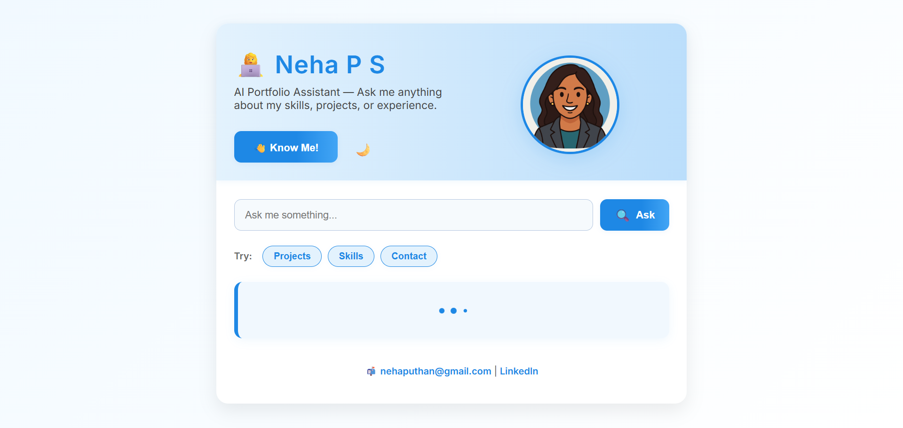

# 💼 Neha P S – AI Portfolio Assistant

An intelligent and interactive portfolio chatbot that answers questions about my resume, skills, projects, and achievements using a simple AI engine built with Flask.

📍 [Live Site → ai-portfolio-assistant.onrender.com](https://ai-portfolio-assistant.onrender.com)


---

## 🔍 Features

- 💬 Ask questions like:
  - "What are your projects?"
  - "What internships have you completed?"
  - "What are your technical skills?"
  - "How can I contact you?"

- 🤖 Smart Q&A using TF-IDF + Cosine Similarity
- 🎨 Modern UI:
  - Avatar and branding
  - Dark mode toggle 🌙
  - “👋 Know Me!” button with playful personal intro
  - Typing animation and pre-filled question suggestions
  - Fully responsive design

---

## 🖼️ UI Preview



---

## 🛠️ Tech Stack

| Layer       | Tools Used                              |
|-------------|------------------------------------------|
| Backend     | Python, Flask                            |
| NLP Engine  | scikit-learn (TF-IDF, Cosine Similarity) |
| Frontend    | HTML, CSS, JS                            |
| Hosting     | Render.com (free tier)                   |
| Knowledge   | `portfolio.json` (structured Q&A)        |

---

## 🗂️ Folder Structure

ai-portfolio-assistant/
├── app.py
├── portfolio.json
├── requirements.txt
├── Procfile
├── README.md
├── screenshot.png
├── templates/
│ └── index.html
└── static/
├── style.css
└── avatar.png

yaml
Copy
Edit

---

## 🚀 Getting Started (Local Setup)

1. **Clone the repository**:

```bash
git clone https://github.com/YOUR_USERNAME/ai-portfolio-assistant.git
cd ai-portfolio-assistant
Install dependencies:

bash
Copy
Edit
pip install -r requirements.txt
Run the app:

bash
Copy
Edit
python app.py
Open browser → http://localhost:5000

🌐 Live Deployment
🔗 Deployed on:
https://ai-portfolio-assistant.onrender.com

Deployed using:

GitHub integration

gunicorn and Procfile

Render’s free web service

📫 Contact Me
✉️ Email: nehaputhan@gmail.com

🔗 LinkedIn: linkedin.com/in/neha-p-s

⭐ Like This Project?
Star it ⭐, fork it 🍴, or use it as a starting point for your own personal AI-powered portfolio!